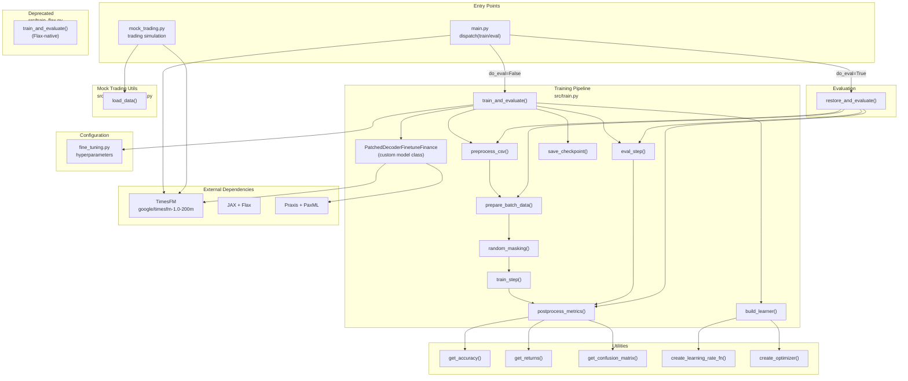

# timesfm_fin Architecture

## Overview

**timesfm_fin** fine-tunes Google's [TimesFM](https://github.com/google-research/timesfm) time-series foundation model on financial data for price prediction. The codebase bridges Google's PaxML/Praxis training infrastructure with financial domain logic — data loading, return calculation, confusion-matrix evaluation, and mock trading simulation.

### Stack

| Layer | Technology | Role |
|---|---|---|
| ML framework | JAX + Flax + PaxML | Distributed training, model parallelism, checkpointing |
| Base model | TimesFM (google/timesfm-1.0-200m) | Pretrained time-series foundation model |
| Training infra | Praxis (layers/optimizers) + PaxML (trainer/checkpoint) | Production-grade training loop |
| Data | pandas + numpy + TensorFlow Datasets | CSV ingestion, batching, masking |
| Metrics | scikit-learn + scipy | Confusion matrices, statistical tests |
| Simulation | numpy + pandas | Mock trading PnL backtest |

### Project Structure

```
timesfm_fin/
├── configs/
│   └── fine_tuning.py          # Hyperparameter config (learning rate, batch size, epochs)
├── src/
│   ├── main.py                 # Entry point — dispatches to train or evaluate
│   ├── train.py                # Primary training pipeline (PaxML/Praxis-based)
│   ├── train_flax.py           # [DEPRECATED] Alternative Flax-native training
│   ├── evaluation.py           # Evaluation pipeline over multiple horizons
│   ├── utils.py                # Shared metrics, learning rate, optimizer factory
│   ├── mock_trading.py         # Mock trading simulation entry point
│   ├── mock_trading_utils.py   # Asset data loading for mock trading
│   └── mock_trading.ipynb      # Exploratory notebook
├── ARCHITECTURE.md             # This file
├── README.md
├── AGENTS.md / CLAUDE.md       # AI workspace configuration
└── .sisyphus/                  # Session continuation artifacts
```

---

## Functional Areas

### 1. Entry Points (`src/main.py`, `src/mock_trading.py`)

Two independent entry points:

- **`main.py`** — Primary entry. Initializes the TimesFM model (either from a local checkpoint or the Google Hub `google/timesfm-1.0-200m`), then routes to training or evaluation based on `--do_eval`.

- **`mock_trading.py`** — Trading simulation entry. Loads a fine-tuned checkpoint and runs forward predictions over historical data, simulating a trading strategy across multiple prediction horizons (2–128 steps).

### 2. Training Pipeline (`src/train.py`) — *core module*

The primary training implementation using PaxML/Praxis. Architecture:

```
┌─────────────────────────────────────────────────────────┐
│                  train_and_evaluate()                    │
│  ┌──────────┐   ┌──────────┐   ┌──────────┐            │
│  │preprocess│ → │prepare   │ → │random    │ → train_step│
│  │_csv()    │   │_batch_   │   │_masking()│   eval_step │
│  └──────────┘   │data()    │   └──────────┘            │
│                 └──────────┘                            │
│                      ↓                                  │
│  ┌──────────────────────────────────────────────────┐   │
│  │ PatchedDecoderFinetuneFinance (custom model)     │   │
│  │  - Wraps TimesFM's patched_decoder               │   │
│  │  - compute_loss(): MSE + quantile loss           │   │
│  │  - __call__(): forward pass with masking         │   │
│  └──────────────────────────────────────────────────┘   │
│                      ↓                                  │
│  ┌──────────────────────────────────────────────────┐   │
│  │ postprocess_metrics() → confusion matrix         │   │
│  │ build_learner() → AdamW + cosine decay           │   │
│  │ save_checkpoint() / restore_checkpoint()         │   │
│  └──────────────────────────────────────────────────┘   │
└─────────────────────────────────────────────────────────┘
```

**Key components:**

| Component | Purpose |
|---|---|
| `train_and_evaluate()` | Full training loop: iterates epochs, logs metrics, saves checkpoints |
| `PatchedDecoderFinetuneFinance` | Custom PaxML model class extending TimesFM's patched decoder with MSE + quantile loss for financial fine-tuning |
| `random_masking()` | Data augmentation — randomly drops suffix of input, forcing model to learn from partial context |
| `train_step()` / `eval_step()` | Single-step forward + loss computation, JIT-compiled |
| `preprocess_csv()` | Reads CSV, normalizes prices, splits train/test by date |
| `prepare_batch_data()` | Constructs NestedMap batches with input_ts, actual_ts, padding, freq |
| `build_learner()` | PaxML learner with AdamW optimizer + warmup cosine decay schedule |
| `postprocess_metrics()` | Computes confusion matrix from prediction returns vs target returns |
| `save_checkpoint()` / `restore_checkpoint()` | PaxML checkpoint I/O |

### 3. Evaluation Pipeline (`src/evaluation.py`)

Reuses many components from `train.py` but focuses on inference-only evaluation:

- `restore_and_evaluate()` — Restores a saved PaxML checkpoint and evaluates across multiple horizons (128, 64, 32, 16, 8, 4, 2).
- Calls `preprocess_csv` → `prepare_batch_data` → `eval_step` → `postprocess_metrics` for each horizon.
- Logs results per horizon: confusion matrix, accuracy, loss.

### 4. Shared Utilities (`src/utils.py`)

Pure-function helpers consumed by all other modules:

| Function | Consumed by |
|---|---|
| `get_accuracy()` | train.py, evaluation.py |
| `get_returns()` | train.py, evaluation.py, train_flax.py |
| `get_confusion_matrix()` | train.py, evaluation.py |
| `create_learning_rate_fn()` | train.py, train_flax.py |
| `create_optimizer()` | train.py, train_flax.py |
| `chance_rate()` | Utility |
| `mse()` | train.py, evaluation.py |

### 5. Mock Trading Simulation (`src/mock_trading.py` + `src/mock_trading_utils.py`)

Backtesting pipeline that simulates trading decisions from model predictions:

1. **Data loading** (`mock_trading_utils.load_data()`) — Loads price data for SP500, TOPIX500, forex, or crypto assets.
2. **Prediction loop** — For each date in the test period, generates predictions at multiple horizons.
3. **Position sizing** — Calculates position based on prediction direction confidence.
4. **PnL simulation** — Computes cumulative PnL, Sharpe ratio, max drawdown, win rate.

### 6. Deprecated Flax Training (`src/train_flax.py`)

An earlier implementation using standalone JAX/Flax (without PaxML). Contains all the same functions (`train_and_evaluate`, `preprocess_csv`, `prepare_batch_data`, etc.) but with native Flax `train_state.TrainState` and `optax` optimizers. **Not recommended for use** — checkpoint compatibility issues between Orbax and PaxML.

### 7. Configuration (`configs/fine_tuning.py`)

Hyperparameter configuration via `ml_collections.ConfigDict`:

| Parameter | Default | Description |
|---|---|---|
| `context_len` / `input_len` | 512 | Input sequence length |
| `output_len` / `horizon_len` | 128 | Prediction horizon |
| `learning_rate` | 1e-4 | Peak learning rate |
| `warmup_epochs` | 5 | LR warmup phase |
| `batch_size` | 1024 (128 × 8) | Training batch size |
| `num_epochs` | 100 | Total training epochs |
| `epochs_per_checkpoint` | 10 | Checkpoint frequency |

---

## Key Execution Flows

### Flow 1: Training (main.py → train.py)

```
main.py                               train.py
┌──────────┐    do_eval=False    ┌─────────────────┐
│ main()   │ ──────────────────→│ train_and_evaluate() │
│          │                    │                     │
│ TimesFM  │                    │ 1. preprocess_csv() │
│ model    │                    │ 2. prepare_batch_   │
│ init     │                    │    data()           │
│          │                    │ 3. random_masking() │
│          │                    │ 4. train_step()     │
│          │                    │    (JIT-compiled)   │
│          │                    │ 5. eval_step()      │
│          │                    │ 6. postprocess_     │
│          │                    │    metrics()        │
│          │                    │ 7. save_checkpoint()│
└──────────┘                    └─────────────────┘
                                        │
                                  ┌─────▼──────┐
                                  │ Metrics per│
                                  │ epoch:     │
                                  │ loss, acc, │
                                  │ conf matrix│
                                  └────────────┘
```

### Flow 2: Evaluation (main.py → evaluation.py)

```
main.py                           evaluation.py
┌──────────┐    do_eval=True    ┌─────────────────────┐
│ main()   │ ─────────────────→│ restore_and_evaluate()│
│          │                    │                      │
│ TimesFM  │                    │ For each horizon     │
│ model    │                    │ (128,64,32,...,2):   │
│          │                    │                      │
│ checkpoint                    │ 1. preprocess_csv()  │
│ loaded   │                    │ 2. prepare_batch_    │
│          │                    │    data()            │
│          │                    │ 3. eval_step()       │
│          │                    │ 4. postprocess_      │
│          │                    │    metrics()         │
│          │                    │ 5. log to file       │
└──────────┘                    └─────────────────────┘
                                        │
                                  ┌─────▼──────┐
                                  │ Per-horizon│
                                  │ accuracy,  │
                                  │ loss, conf │
                                  └────────────┘
```

### Flow 3: Mock Trading (mock_trading.py)

```
mock_trading.py                  mock_trading_utils.py
┌──────────────────┐    calls    ┌──────────────────────┐
│ main()           │ ──────────→ │ load_data(asset)     │
│                  │             │                      │
│ For each date    │             │ Returns: price df    │
│ in test period:  │             └──────────────────────┘
│                  │
│ 1. Get last 512  │
│    timesteps     │     TimesFM
│ 2. Generate      │ ◄────────── model.forecast()
│    prediction    │
│ 3. Position =    │
│    sign(pred) ×  │
│    confidence    │
│ 4. Simulate PnL  │
│                  │
│ For each horizon:│
│ (2,4,8,16,32,   │
│  64,128)         │
│                  │
│ ──────────────── │
│ Output metrics:  │
│ Sharpe ratio,    │
│ max drawdown,    │
│ win rate,        │
│ total PnL        │
└──────────────────┘
```

### Flow 4: Data Preprocessing (shared)

```
preprocess_csv(dataset_path, output_len)
│
├─ Read CSV → convert to datetime index
├─ Normalize prices: p[t] / p[t-output_len] - 1
├─ Split by date: train < cutoff_date ≤ test
├─ Train: reshape into sliding windows
│   (batch_size × context_len + output_len)
├─ Test: sequential windows without overlap
│
└─ Returns: (train_inputs, train_outputs, test_inputs, test_outputs, freq)
```

### Flow 5: Random Masking (data augmentation)

```
random_masking(batch, context_len=512, output_len=128)
│
├─ random_drop = randint(0, context_len - output_len)
│
├─ If drop > 0:
│   ├─ Remove last `random_drop` timesteps
│   └─ Prepend ones vector (padding marker)
│
├─ output = last output_len timesteps
├─ input = all but last output_len timesteps
├─ padding = binary mask (0=real, 1=padded)
│
└─ Returns: (input_sequences, output_sequences, input_padding)
```

---

## Module Dependency Graph

```
                    ┌──────────────┐
                    │  main.py     │
                    │  (dispatcher) │
                    └──────┬───────┘
                           │
              ┌────────────┼────────────┐
              ▼            ▼            ▼
      ┌────────────┐ ┌──────────┐ ┌──────────────┐
      │ train.py   │ │evaluation│ │ mock_trading │
      │(core       │ │.py       │ │ .py          │
      │ training)  │ │(eval     │ │(trading sim) │
      └──────┬─────┘ │pipeline) │ └──────┬───────┘
             │       └─────┬────┘        │
             │             │             │
             ▼             ▼             ▼
      ┌───────────────────────────────────────┐
      │             utils.py                  │
      │  (get_accuracy, get_returns,          │
      │   get_confusion_matrix,               │
      │   create_learning_rate_fn,            │
      │   create_optimizer)                   │
      └───────────────────────────────────────┘
                      │
                      ▼
      ┌───────────────────────────────────────┐
      │          train_flax.py                │
      │  [DEPRECATED - Flax-native alt]       │
      └───────────────────────────────────────┘
```

---

## Architecture Diagram



---

## Data Flow

```
Raw CSV
   │
   ▼
preprocess_csv()
   ├─ Normalize: p[t] / p[t-horizon] - 1
   ├─ Train/test split by date
   └─ Sliding window reshaping
   │
   ▼
prepare_batch_data()
   ├─ NestedMap{input_ts, actual_ts, input_padding, freq}
   └─ JAX device placement
   │
   ▼
random_masking()  ──── only during training ────┐
   │                                             │
   ▼                                             │
PatchedDecoderFinetuneFinance.forward()           │
   ├─ TimesFM patched_decoder                     │
   ├─ output_ts = model(input_ts, padding)        │
   └─ MSE + quantile loss                         │
   │                                             │
   ▼                                             │
postprocess_metrics()                             │
   ├─ get_returns(predictions, inputs)            │
   ├─ get_confusion_matrix(pred_ret, tgt_ret)    │
   └─ get_accuracy(conf_matrix)                   │
   │                                             │
   ▼                                             │
train_and_evaluate() ─────────────────────────────┘
   ├─ Log epoch metrics
   ├─ Save checkpoint every N epochs
   └─ Return final TrainState
```

---

## Key Design Decisions

1. **PaxML over raw Flax** — The primary training path (`train.py`) uses PaxML (`paxml.trainer_lib`) for production-grade training with partitioning, checkpointing, and metric writers. The earlier Flax-native path (`train_flax.py`) is deprecated due to checkpoint incompatibility.

2. **MSE + Quantile Loss** — The custom model adds quantile loss on top of MSE, preserving TimesFM's probabilistic forecasting capability while optimizing for directional accuracy.

3. **Random Masking** — Augments training by randomly dropping suffix timesteps, forcing the model to learn from partial context — a technique suited to financial data where recent observations carry more signal.

4. **Returns-based Evaluation** — Model outputs (normalized prices) are converted to returns before computing confusion matrices, aligning evaluation with the trading use case (directional prediction).

5. **Multiple Horizons** — Evaluation and mock trading both test across multiple prediction horizons (2–128 timesteps), measuring how prediction quality degrades with horizon length.

---

## Module Boundaries

| Module | Fan-in | Fan-out | Layer | Description |
|---|---|---|---|---|
| `utils.py` | 6 | 0 | **core** | No internal deps; consumed by all |
| `train.py` | 5 | 4 | **core** | Central training logic |
| `evaluation.py` | 1 | 5 | internal | Depends on train.py functions |
| `main.py` | 0 | 2 | **entry** | Only outbound calls |
| `mock_trading.py` | 0 | 1 | **entry** | Only outbound calls |
| `mock_trading_utils.py` | 1 | 0 | leaf | Only inbound calls |
| `train_flax.py` | 0 | 2 | deprecated | Standalone, no dependents |

---

## Risk Hotspots

Based on graph analysis, these symbols have highest fan-in (most callers):

| Symbol | File | Fan-in | Risk |
|---|---|---|---|
| `save_checkpoint()` | `train.py` | 2 | MEDIUM |
| `prepare_batch_data()` | `train.py` | 2 | MEDIUM |
| `postprocess_metrics()` | `train.py` | 2 | MEDIUM |
| `build_learner()` | `train.py` | 2 | MEDIUM |
| `reshape_batch()` | `train.py` | 2 | MEDIUM |
| `preprocess_csv()` | `train.py` | 2 | MEDIUM |
| `get_accuracy()` | `utils.py` | 2 | MEDIUM |
| `get_returns()` | `utils.py` | 2 | MEDIUM |
| `get_confusion_matrix()` | `utils.py` | 2 | MEDIUM |

Changes to these functions affect both training and evaluation pipelines.
